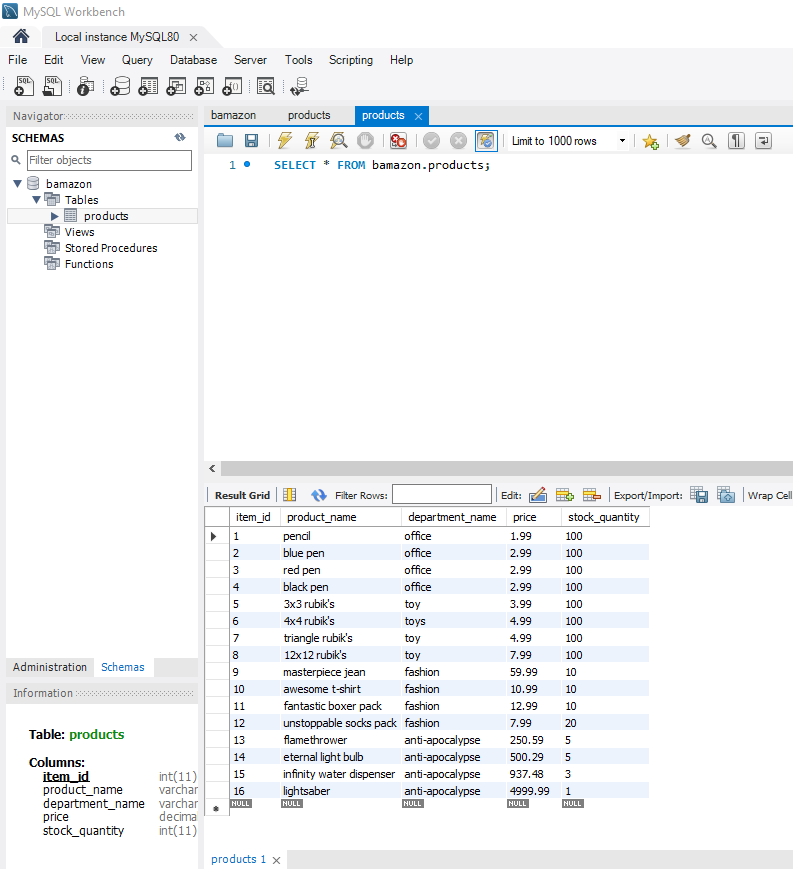
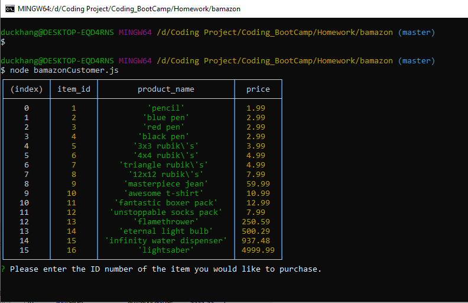
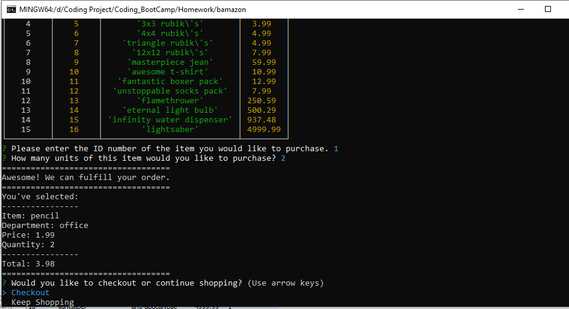
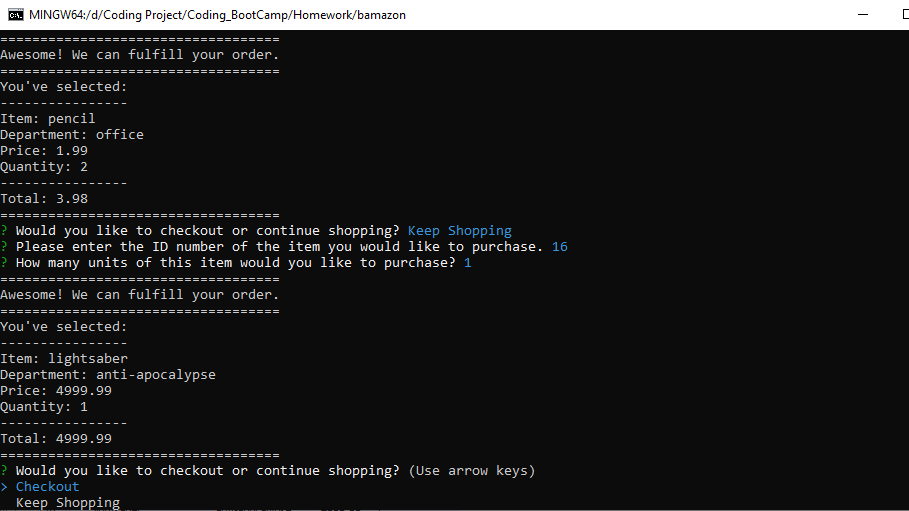
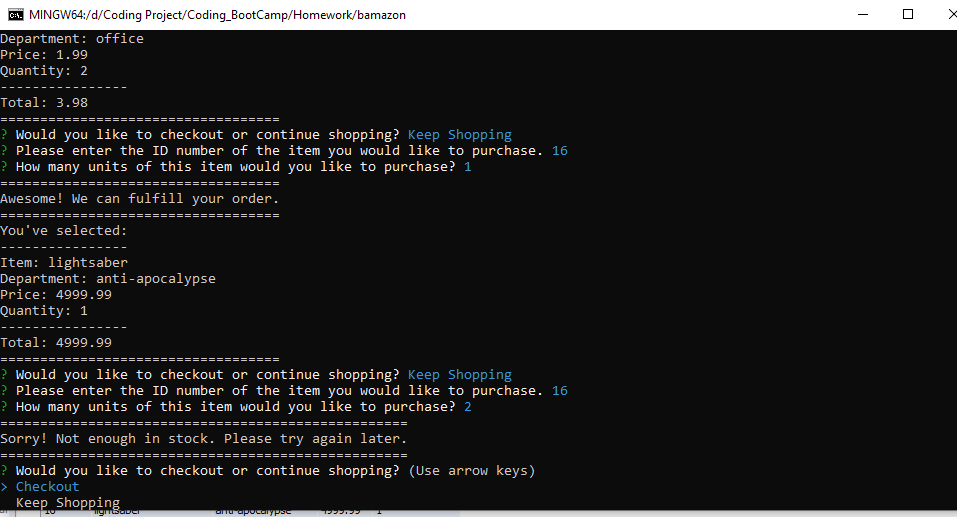
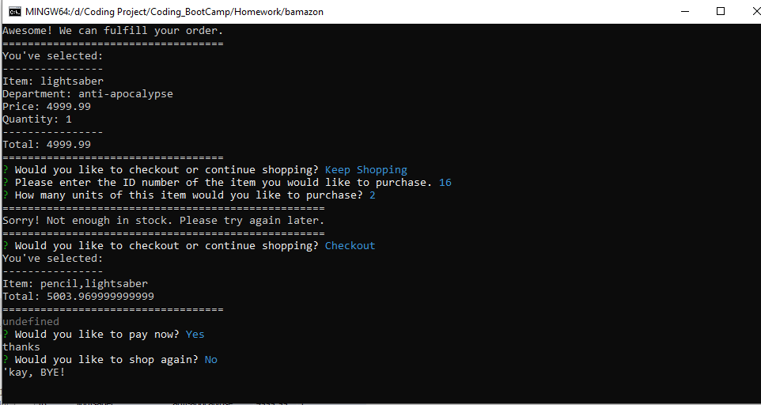
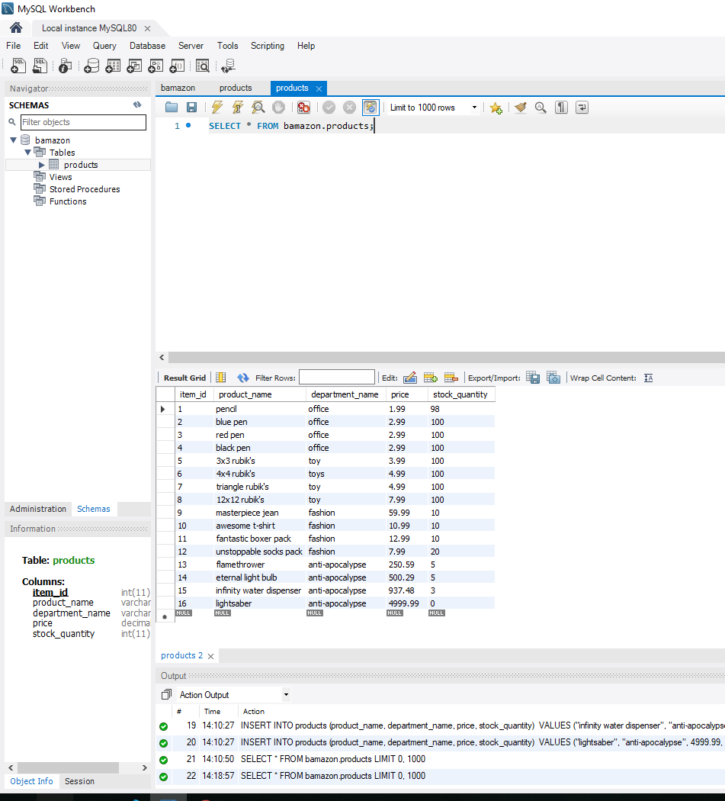

# bamazon

This application implements a simple command line based storefront using the npm inquirer package and the MySQL database backend together with the npm mysql package.

## SQL Setup

In order to run this application, you should have the MySQL database already set up on your machine. If you don't, visit the MySQL installation page to install the version you need for your operating system. Once you have MySQL isntalled, you will be able to create the Bamazon database and the products table with the SQL code found in Bamazon.sql. Run this code inside your MySQL client like Sequel Pro to populate the database, then you will be ready to proceed with running the Bamazon customer and manager interfaces.

## Demo

### Product database



### Run app
We start Bamazon app with command line ```node bamazonCustomer.js```



### Buying

Next, it'll ask you to input the ```item_id``` of the product and quantity that you want to buy



Then it'll ask if you want to checkout or keep shopping. I chose to keep shopping for one lightsaber 



Hmm, maybe one is not enough, so I buy another one. But bamazon only has 1 lightsaber in stock. So it declined my 3rd purchase.



### Checkout

Okay, maybe one saber is enough. I decided to checkout. Bamazon will show all the product that you have in cart and total cost.



### Update stock_quantity in database


